```
╔══════════════════════════════════════════════════════════╗
║                                                            ║
║        A P P L I E D   M A C H I N E   L E A R N I N G     ║
║                                                            ║
╚══════════════════════════════════════════════════════════╝
```

<div align="center">

### My survival notes.

</div>

---

## Table of Contents

1. [How to actually use this repo](#how-to-actually-use-this-repo)
2. [The book you will live in](#the-book-you-will-live-in)
3. [What we are actually covering](#what-we-are-actually-covering)
4. [The phases, the honest version](#the-phases-the-honest-version)
5. [The capstone, real talk](#the-capstone-real-talk)
6. [Grading, briefly](#grading-briefly)
7. [Other books worth having open](#other-books-worth-having-open)
8. [Setup, start to finish](#setup-start-to-finish)
9. [Before you start](#before-you-start)

---

## How to actually use this repo

```
applied-ml/
├── phase-1-foundations/
├── phase-2-data-engineering/
├── phase-3-classical-ml/
├── phase-4-unsupervised/
├── phase-5-deep-learning-vision/
├── phase-6-capstone-proposal/
├── phase-7-sequence-genai/
├── phase-8-mlops/
│   ├── serving/
│   ├── tracking-cicd/
│   └── monitoring/
├── phase-9-capstone-deploy/
│   ├── data_pipeline/
│   ├── model_training/
│   ├── api/
│   └── frontend/
├── requirements.txt
└── README.md
```

Every folder should stand on its own. Save your cleaned data and trained models to disk at the end
of each phase instead of trusting that "the notebook is still open in another tab." Future you will
not remember to reopen it. Commit after every session, even the messy ones; a real history is worth
more than a tidy one you rewrote later.

## The book you will live in

<table align="center">
<tr>
<td width="220" align="center" valign="top">

```
┌─────────────────────┐
│                      │
│   H A N D S - O N    │
│                      │
│   MACHINE LEARNING   │
│                      │
│  Scikit-Learn        │
│  Keras               │
│  TensorFlow          │
│                      │
│   ───────────────    │
│                      │
│   Aurélien Géron     │
│                      │
│   O'Reilly Media     │
│                      │
└─────────────────────┘
```

</td>
<td valign="top">

**Get this before you start.** The 2nd edition (2019) or 3rd (2022), either works, the concepts do
not change between them, only some of the library syntax.

Almost everything in this repo is a retelling of a chapter in this book, so the honest move is to
read the chapter before you touch the notebook, not after. Chapter 1 in full, plus the start of
Chapter 2, is worth finishing before Phase One.

If a notebook moves too fast, it is because it is compressing forty pages of Géron into a few cells.
Go back to the book, not the code comments.

</td>
</tr>
</table>

## What we are actually covering

This is the honest scope of the whole thing, before it gets broken into phases:

- Building a real, leak-free ML pipeline from raw, messy data to a sealed test-set evaluation
- Classical and ensemble methods (trees, forests, gradient boosting) done rigorously, not just called
- Unsupervised learning for when there is no label to check yourself against
- Deep learning for vision, from a first MLP through transfer learning on real image data
- Sequence models and time series, up through Transformer-based forecasting
- Modern generative AI: fine-tuning LLMs and building retrieval-augmented pipelines
- Packaging and serving a model as a real API (FastAPI, Docker)
- Experiment tracking and CI/CD, so "it worked on my machine" stops being an excuse
- Monitoring a deployed model for drift, and knowing when to retrain
- A full end-to-end capstone that touches every one of the above, anchored in African fintech,
  trade-corridor, and health data problems

## The phases, the honest version

```mermaid
flowchart LR
    A["Foundations"] --> B["Data\nEngineering"]
    B --> C["Classical ML\n& Ensembles"]
    C --> D["Unsupervised\nLearning"]
    D --> E["Deep Learning\n& Vision"]
    E --> F["Capstone\nProposal"]
    F --> G["Sequences\n& GenAI"]
    G --> H["MLOps:\nServe, Track,\nMonitor"]
    H --> I["Capstone\nDeploy & Defend"]

    style A fill:#dbeafe,stroke:#2563eb
    style B fill:#dcfce7,stroke:#16a34a
    style C fill:#fef9c3,stroke:#ca8a04
    style D fill:#fae8ff,stroke:#a21caf
    style E fill:#ffe4e6,stroke:#e11d48
    style F fill:#f1f5f9,stroke:#64748b
    style G fill:#e0e7ff,stroke:#4338ca
    style H fill:#fee2e2,stroke:#b91c1c
    style I fill:#fef3c7,stroke:#b45309
```



The early phases are slow on purpose. The back half moves fast and stops feeling like a data science
project entirely, it starts feeling like software engineering with a model bolted on. That is not an
accident, that is the actual job.

### Phase One. Foundations, and the environment you will live in
Setting up Git, VS Code, a virtual environment, and your first honest baseline pipeline, alongside
the conceptual core: the gap between the risk you can measure on data, `R-hat`, and the risk you
actually care about, `R`. Every later phase exists because that gap is real and closing it is the
whole engineering problem.

Do not skip: the difference between a majority-class baseline and a "real" model. If your fancy
model cannot beat the boring one, the boring one wins, full stop.

Quiet trap: treating this phase as throwaway. The repo habits you set now (commit discipline,
keeping a sealed test set, honest baselines) are the habits that show up in the capstone at the end.

### Phase Two. Data engineering, or where projects quietly die
Encoding strategies, missing data, and leakage. This phase has a body count. Four ways it happens:
target leakage (a feature that is secretly a proxy for the label), temporal leakage (a feature
computed using information from the future), train/test contamination (fitting a scaler or encoder
on the full dataset before splitting), and group leakage (the same entity appearing in both train
and test).

Rule worth tattooing on your notebook: if a result looks too good, suspect leakage first, not
brilliance.

### Phase Three. Classical ML, evaluation, and ensembles
SMOTE, ROC-AUC, precision-recall curves, then Random Forests, XGBoost, LightGBM, and automated
tuning with Optuna. The thing nobody tells you early enough: on imbalanced data (say, a 5 percent
default rate), a model that predicts "never default" scores 95 percent accuracy and is completely
useless. Accuracy lies. Optimize for the cost your business actually pays when it is wrong.

Watch yourself on tuning: it is very easy to push hyperparameters until your cross-validation score
looks incredible and your test score does not move. That is not tuning, that is overfitting the
folds. The sealed test set exists for exactly this reason.

### Phase Four. Unsupervised learning
K-Means, DBSCAN, PCA, t-SNE. Useful mental shift here: there is no label to check yourself against
anymore, so your job moves from "did I get it right" to "is this structure meaningful, or did I
just find noise that looks like a pattern."

### Phase Five. Deep learning and computer vision
A first MLP in PyTorch or TensorFlow, then transfer learning on ResNet or EfficientNet. If the shift
from scikit-learn feels like a jump, it is, on purpose. Give yourself permission to feel behind for a
session or two, everyone does. The lesson underneath: you almost never train a vision model from
scratch in the real world, you fine-tune something already pretrained, and learning to do that well
is most of applied computer vision work.

### Phase Six. Capstone proposal checkpoint
No new material, this is where your capstone proposal and dataset approval are due. The people who
struggle later are, almost without exception, the ones who picked a dataset here without checking
whether it is actually gettable, clean enough, and free of the leakage traps from Phase Two. Start
looking early, not the night before this checkpoint.

### Phase Seven. Sequence models and modern generative AI
LSTMs, GRUs, a first look at Temporal Fusion Transformers, then HuggingFace, LLM fine-tuning, and
retrieval-augmented generation. If your capstone involves anything with a time axis (transaction
history, claims over time), the sequence half of this phase matters most for you.

Worth internalizing early on the GenAI half: LLMs are genuinely useful for language and
orchestration work (document understanding, retrieval, routing an edge case to a human), but for
core tabular scoring, gradient-boosted trees still win on accuracy, latency, and the kind of
explainability a regulator will ask for. Do not force an LLM into a job Phase Three already does
better.

### Phase Eight. MLOps: serving, tracking, and monitoring
FastAPI and Docker for packaging, MLflow and CI/CD for tracking and automation, then Evidently AI
for drift detection. This is the phase where a notebook stops being a deliverable and starts being a
liability. A model nobody can serve is not a finished project, it is a draft. And a deployed model
is a liability under maintenance, not a finished artifact: data drifts, concepts drift, and the plan
for noticing that has to be built in from the start, not bolted on after something breaks.

### Phase Nine. Capstone deployment and defense
Cloud deployment, load testing, peer debugging, then live demos. Everything from Phase One onward
was building toward this. If you kept your repo honest the whole way through, this part is mostly
assembly. If you did not, this is where it shows.

---

## The capstone, real talk

Sixty percent of your grade, and the shape never changes: **data pipeline, model training, API
deployment, frontend**, all inside `phase-9-capstone-deploy/`. Suggested directions, all rooted in
problems that actually exist in this region:

| Track | The real problem |
|---|---|
| Fintech / under-banking | Credit scoring for thin-file applicants using mobile-money transaction history |
| Trade-corridor underwriting | Risk modelling for cross-border SME lending |
| Health informatics | Treatment-policy modelling with Markov decision processes and RL |
| Fraud & AML | Streaming anomaly detection on payment rails, with drift monitoring |

Pick something you can get honest, reasonably clean data for. A brilliant idea with a dataset you
cannot actually access, or one so messy it eats your whole timeline the way Phase Two almost did, is
a worse choice than a boring idea you can finish end to end.

## Grading, briefly

```
Labs & quizzes     ████████                              20%
Midterm            ████████                              20%
Capstone            ████████████████████████             60%
```

No written final. The capstone and the midterm carry almost everything, which is the point, it
mirrors how you will actually be evaluated once you are doing this for a living.

## Other books worth having open

- Chip Huyen, *Designing Machine Learning Systems* (free on GitHub: chiphuyen/dmls-book) - take this
  over Géron once you hit Phase Eight, it is the better guide for the MLOps half
- Simon J.D. Prince, *Understanding Deep Learning* (free: udlbook.github.io/udlbook) - denser theory
  for Phases Five through Seven, if the "why" behind an architecture is bothering you
- Christopher Bishop, *Deep Learning: Foundations and Concepts* (bishopbook.com) - same territory as
  Prince, different explanations, useful when one of them is not clicking
- HuggingFace's own docs and courses, genuinely better than most textbook chapters for the GenAI
  phase

## Setup, start to finish

```bash
git clone https://github.com/<your-username>/applied-ml.git
cd applied-ml

python3.11 -m venv .venv
source .venv/bin/activate          # Windows: .venv\Scripts\activate

pip install -r requirements.txt

jupyter lab phase-1-foundations/notebooks/
```

From Phase Eight onward you will also need Docker running:

```bash
docker --version
docker compose up --build
```

If something breaks during setup, post the exact error and your operating system to the class forum
instead of messaging privately. Someone else will hit the same wall a day later and your thread
saves them the same afternoon it cost you.

## Before you start

- [ ] Git, VS Code, Python 3.11+ installed
- [ ] GitHub account created, this repo cloned
- [ ] Géron Chapter 1 read in full, Chapter 2 started
- [ ] Laptop charged, actually bring it
- [ ] Start quietly noticing a real problem in your own work or environment that data could
      address, this is where your capstone idea will come from, and the earlier you start
      collecting it in the back of your mind, the less panicked the proposal checkpoint will feel