```
██████╗ ███████╗ █████╗     ████████╗██╗  ██╗ ██████╗  ██╗
██╔══██╗██╔════╝██╔══██╗    ╚══██╔══╝██║  ██║██╔═████╗███║
██║  ██║███████╗███████║       ██║   ███████║██║██╔██║╚██║
██║  ██║╚════██║██╔══██║       ██║   ╚════██║████╔╝██║ ██║
██████╔╝███████║██║  ██║       ██║        ██║╚██████╔╝ ██║
╚═════╝ ╚══════╝╚═╝  ╚═╝       ╚═╝        ╚═╝ ╚═════╝  ╚═╝
```

<div align="center">

# my dsa8401 survival notes
### applied machine learning, walked through week by week, the way I wish someone had explained it to me

</div>

---

Nobody hands you a course outline you actually want to read. This is not that. This is the repo I
wish existed on day one: what each week is really asking of you, what quietly bites people, what to
actually read versus skim, and where the whole thing is headed so Week 11 does not blindside you.

Read it top to bottom once before Week 1, then come back to whichever week you are drowning in.

## Table of Contents

1. [How to actually use this repo](#how-to-actually-use-this-repo)
2. [The book you will live in](#the-book-you-will-live-in)
3. [The shape of the whole semester](#the-shape-of-the-whole-semester)
4. [Week by week, the honest version](#week-by-week-the-honest-version)
5. [The capstone, real talk](#the-capstone-real-talk)
6. [Grading, briefly](#grading-briefly)
7. [Other books worth having open](#other-books-worth-having-open)
8. [Setup, start to finish](#setup-start-to-finish)
9. [Before Week 1](#before-week-1)

---

## How to actually use this repo

```
dsa8401-applied-ml/
├── week-01-foundations/
├── week-02-data-prep/
├── week-03-classical-ml/
├── week-04-ensembles/
├── week-05-unsupervised/
├── week-06-deep-learning/
├── week-07-computer-vision/
├── week-08-break/              # this is where the capstone proposal lives, not a real break
├── week-09-sequence-models/
├── week-10-genai-llms/
├── week-11-mlops-serving/
├── week-12-mlops-cicd/
├── week-13-monitoring/
├── week-14-15-capstone/
│   ├── data_pipeline/
│   ├── model_training/
│   ├── api/
│   └── frontend/
├── requirements.txt
└── README.md
```

Every folder should stand on its own. Save your cleaned data and trained models to disk at the end
of each week instead of trusting that "the notebook is still open in another tab." Future you, three
weeks from now, will not remember to reopen it. Commit after every lab, even the messy ones; a real
history is worth more than a tidy one you rewrote later.

## The book you will live in

<table align="center">
<tr>
<td width="220" align="center" valign="top">

```
┌─────────────────────┐
│                      │
│   H A N D S - O N    │
│                      │
│   MACHINE LEARNING   │
│                      │
│  Scikit-Learn        │
│  Keras               │
│  TensorFlow          │
│                      │
│   ───────────────    │
│                      │
│   Aurélien Géron     │
│                      │
│   O'Reilly Media     │
│                      │
└─────────────────────┘
```

</td>
<td valign="top">

**Get this before Week 1.** The 2nd edition (2019) or 3rd (2022), either works, the concepts do not
change between them, only some of the library syntax.

Almost every lecture this semester is a retelling of a chapter in this book, so the honest move is
to read the chapter before the lecture rather than after. Chapter 1 in full, plus the start of
Chapter 2, is due before you even walk into Week 1.

If a slide moves too fast, it is because it is compressing forty pages of Géron into six bullet
points. Go back to the book, not the slide.

</td>
</tr>
</table>

## The shape of the whole semester

```mermaid
flowchart LR
    A["Wk 1-2\nFoundations &\nData Prep"] --> B["Wk 3-4\nClassical ML &\nEnsembles"]
    B --> C["Wk 5\nUnsupervised"]
    C --> D["Wk 6-7\nDeep Learning &\nVision"]
    D --> E["Wk 8\nBreak, but the\nproposal is due"]
    E --> F["Wk 9-10\nSequences &\nGenAI"]
    F --> G["Wk 11-13\nMLOps: ship it,\nwatch it"]
    G --> H["Wk 14-15\nDeploy & defend\nthe capstone"]

    style A fill:#dbeafe,stroke:#2563eb
    style B fill:#dcfce7,stroke:#16a34a
    style C fill:#fef9c3,stroke:#ca8a04
    style D fill:#fae8ff,stroke:#a21caf
    style E fill:#f1f5f9,stroke:#64748b
    style F fill:#ffe4e6,stroke:#e11d48
    style G fill:#e0e7ff,stroke:#4338ca
    style H fill:#fee2e2,stroke:#b91c1c
```



The first half is slow on purpose. The back half moves fast and stops feeling like a data science
course entirely, it starts feeling like software engineering with a model bolted on. That is not an
accident, that is the actual job.

---

## Week by week, the honest version

### Week 1. Foundations, and the environment you will live in all semester
What happens: an hour on the ML landscape (what learning even is, why the bias-variance split
matters, why systems fail in production more often than models do), thirty minutes of syllabus, then
ninety minutes setting up Git, VS Code, a virtual environment, and your first honest baseline
pipeline.

What actually matters: the gap between the risk you can measure on data, `R-hat`, and the risk you
actually care about, `R`. Every later week exists because that gap is real and closing it is the
whole engineering problem.

Do not skip: the difference between a majority-class baseline and a "real" model. If your fancy
model cannot beat the boring one, the boring one wins, full stop.

Quiet trap: treating Week 1 as throwaway. The repo habits you set now (commit discipline, keeping a
sealed test set, honest baselines) are the habits the capstone grader will actually notice in Week
15.

### Week 2. Data prep, or where projects quietly die
Encoding strategies, missing data, and leakage. This week has a body count. Four ways it happens:
target leakage (a feature that is secretly a proxy for the label), temporal leakage (a feature
computed using information from the future), train/test contamination (fitting a scaler or encoder
on the full dataset before splitting), and group leakage (the same entity appearing in both train
and test).

Rule worth tattooing on your notebook: if a result looks too good, suspect leakage first, not
brilliance.

### Week 3. Classical ML and evaluation that does not lie to you
SMOTE, ROC-AUC, precision-recall curves. The thing nobody tells you early enough: on imbalanced
data (say, a 5 percent default rate), a model that predicts "never default" scores 95 percent
accuracy and is completely useless. Accuracy lies. Optimize for the cost your business actually
pays when it is wrong, not for a number that looks good in a slide.

### Week 4. Ensembles and tuning
Random Forest, XGBoost, LightGBM, then Optuna for automated tuning. Watch yourself here: it is
very easy to tune hyperparameters until your cross-validation score looks incredible and your test
score does not move. That is not tuning, that is overfitting the folds. The sealed test set exists
for exactly this reason, do not touch it until the very end.

### Week 5. Unsupervised learning
K-Means, DBSCAN, PCA, t-SNE. Useful mental shift here: there is no label to check yourself against
anymore, so your job moves from "did I get it right" to "is this structure meaningful, or did I
just find noise that looks like a pattern."

### Week 6. Deep learning, the transition week
MLPs in PyTorch or TensorFlow. If this week feels like a jump, it is, on purpose, this is where the
course pivots from scikit-learn to a different mental model entirely. Give yourself permission to
feel behind for a session or two, everyone does.

### Week 7. Computer vision
Transfer learning on ResNet or EfficientNet. The lesson underneath the code: you almost never train
a vision model from scratch in the real world, you fine-tune something already pretrained. Learn to
do that well, it is 90 percent of applied CV work.

### Week 8. The "break" that is not really a break
No class, but this is when your capstone proposal and dataset approval are due. The people who
struggle in Week 14 are, almost without exception, the ones who picked a dataset in Week 8 without
checking whether it is actually gettable, clean enough, and free of the leakage traps from Week 2.
Start looking now, not the night before.

### Week 9. Sequence models and time series
LSTMs, GRUs, a first look at Temporal Fusion Transformers. If your capstone involves anything with
a time axis (transaction history, claims over time), this is the week that actually matters most for
you, pay closer attention than the syllabus implies you need to.

### Week 10. Modern GenAI, Transformers, LLMs, RAG
HuggingFace, fine-tuning, retrieval-augmented generation. Worth internalizing early: LLMs are
genuinely useful for language and orchestration work (document understanding, retrieval, routing an
edge case to a human), but for core tabular scoring, gradient-boosted trees still win on accuracy,
latency, and the kind of explainability a regulator will ask for. Do not force an LLM into a job a
Week 4 model already does better.

### Week 11. MLOps I, packaging and serving
FastAPI and Docker. This is the week a notebook stops being a deliverable and starts being a
liability. A model nobody can serve is not a finished project, it is a draft.

### Week 12. MLOps II, tracking and CI/CD
MLflow, GitHub Actions. Boring, essential, and the part of the semester that most separates "data
scientist" from "ML engineer" on a CV.

### Week 13. Monitoring, drift, system design
Evidently AI, and the uncomfortable truth that a deployed model is a liability under maintenance,
not a finished artifact. Data drifts, concepts drift, and the plan for noticing that has to be built
in from the start, not bolted on after something breaks.

### Week 14 to 15. Deploy, test, defend
Cloud deployment, load testing, peer debugging, then live demos. Everything from Weeks 1 through 13
was building toward these two weeks. If you kept your repo honest the whole way, this part is mostly
assembly. If you did not, this is where it shows.

---

## The capstone, real talk

Sixty percent of your grade, and the shape never changes: **data pipeline, model training, API
deployment, frontend**, all inside `week-14-15-capstone/`. Suggested directions, all rooted in
problems that actually exist in this region:

| Track | The real problem |
|---|---|
| Fintech / under-banking | Credit scoring for thin-file applicants using mobile-money transaction history |
| Trade-corridor underwriting | Risk modelling for cross-border SME lending |
| Health informatics | Treatment-policy modelling with Markov decision processes and RL |
| Fraud & AML | Streaming anomaly detection on payment rails, with drift monitoring |

Pick something you can get honest, reasonably clean data for. A brilliant idea with a dataset you
cannot actually access, or one so messy it eats your whole semester in Week 2 all over again, is a
worse choice than a boring idea you can finish end to end.

## Grading, briefly

```
Labs & quizzes     ████████                              20%
Midterm            ████████                              20%
Capstone            ████████████████████████             60%
```

No written final. The capstone and the midterm carry almost everything, which is the point, it
mirrors how you will actually be evaluated once you are doing this for a living.

## Other books worth having open

- Chip Huyen, *Designing Machine Learning Systems* (free on GitHub: chiphuyen/dmls-book) - take this
  over Géron once you hit Week 11, it is the better guide for the MLOps half
- Simon J.D. Prince, *Understanding Deep Learning* (free: udlbook.github.io/udlbook) - denser theory
  for Weeks 6 through 10, if the "why" behind a network architecture is bothering you
- Christopher Bishop, *Deep Learning: Foundations and Concepts* (bishopbook.com) - same territory as
  Prince, different explanations, useful when one of them is not clicking
- HuggingFace's own docs and courses, genuinely better than most textbook chapters for Week 10

## Setup, start to finish

```bash
git clone https://github.com/<your-username>/dsa8401-applied-ml.git
cd dsa8401-applied-ml

python3.11 -m venv .venv
source .venv/bin/activate          # Windows: .venv\Scripts\activate

pip install -r requirements.txt

jupyter lab week-01-foundations/notebooks/
```

From Week 11 onward you will also need Docker running:

```bash
docker --version
docker compose up --build
```

If something breaks during setup, post the exact error and your operating system to the Week 1
forum instead of messaging privately. Someone else will hit the same wall a day later and your
thread saves them the same afternoon it cost you.

## Before Week 1

- [ ] Git, VS Code, Python 3.11+ installed
- [ ] GitHub account created, this repo cloned
- [ ] Géron Chapter 1 read in full, Chapter 2 started
- [ ] Laptop charged, actually bring it
- [ ] Start quietly noticing a real problem in your own work or environment that data could
      address, this is where your Week 8 capstone idea will come from, and the earlier you start
      collecting it in the back of your mind, the less panicked Week 8 will feel